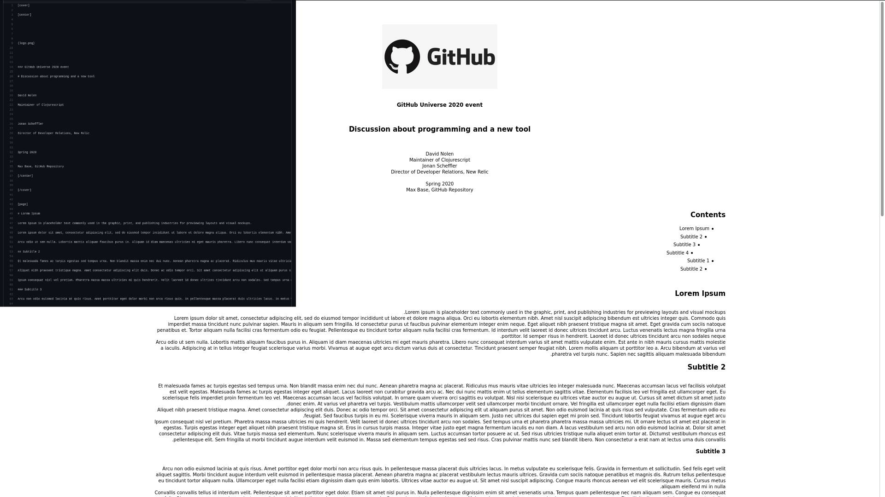

# bookpam

BookPam is a typesetting system; it includes features designed for the production of technical documentation and book.
BookPam is available as free software.

[](https://basemax.github.io/bookpam/examples.html)

## Features

- Support cover of book
- Auto generate Contents list
- Auto generator to HTML documents (with minimal style for title, block, etc.)
- Highlight one own language syntaxe
- Auto generate Functions list at bottom of book

### Examples

Watch web and html-based book at [here](https://basemax.github.io/bookpam/examples.html)

Pure pam file format avaiable at [here](examples.pam)

### Using bookpam

Generate examples.html from examples.pam by running following command:

```
python bookpam.py
```

### Commands

This structure may be somewhat similar to markdown, but it is not.
It has more features that can help us in writing documentaries and books.

- `[center] put here [/center]`
- `[page] put here [/page]`
- `#` `##` `###` `####` `#####` `######`
- `\n`: go to new line
- `<<FUNCTION_NAME>>`
- ``` `IDENT_NAME` ```

### Example document

```
[cover]

[center]


{logo.png}


### GitHub Universe 2020 event

# Discussion about programming and a new tool


David Nolen
 
Maintainer of Clojurescript 


Jonan Scheffler

Director of Developer Relations, New Relic 


Spring 2020


Max Base, GitHub Repository

[/center]


[/cover]


[page]

# Lorem Ipsum

Lorem ipsum is placeholder text commonly used in the graphic, print, and publishing industries for previewing layouts and visual mockups.

....
....
....

[/page]
```

# TODO

- Support RTL and LTR (`html[dir=rtl]{}`, `html[dir=ltr]{}`)
- Ability to set own font for book (Optional)
- Highlight multi language code syntaxes
- Adding command parser for `bookpam.py` e.g: `--help`, `--version`, and other optional setting, etc.
- Apply a custom style for top and bottom of every page using `@page{}` in print mode of browser.
- Generate **PDF** file from **html** file.
- Get own style.css file from user via command parser CLI
- Adding bookpam to `pip` python package management

## Partnership and development

Please send issue or pull request if you found a bug or problem.
Feel free to discuss or send pull...

# License

**BookPam** is licensed under the [GNU General Public License](LICENSE).

`logo.png` file is just a example file and it's not licensed under this project.

---------

# Max Base

My nickname is Max, Programming language developer, Full-stack programmer. I love computer scientists, researchers, and compilers. ([Max Base](https://maxbase.org/))

## Asrez Team

A team includes some programmer, developer, designer, researcher(s) especially Max Base.

[Asrez Team](https://www.asrez.com/)
